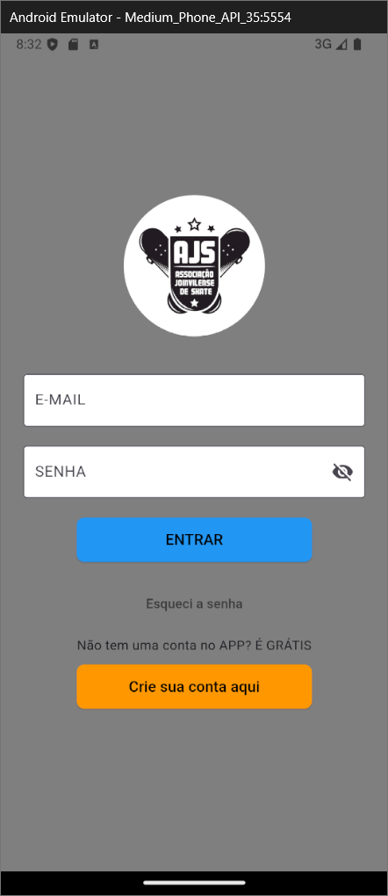

### **Título do Projeto**
AJS Skate App  

---

### **PAC - Projeto de Aprendizagem Colaborativa Extensionista**
**Curso:** Engenharia de Software - Católica de Santa Catarina  
**Objetivo do PAC:** Desenvolver um aplicativo que fortaleça a interação e a comunicação entre a **Associação Joinvilense de Skate (AJS)** e seus membros, promovendo eventos, notícias e integração da comunidade local de skatistas.  

---

### **Justificativa do PAC**
O projeto foi idealizado para atender às demandas da **Associação Joinvilense de Skate (AJS)**, uma entidade que promove a prática e cultura do skate em Joinville. Através do aplicativo, a entidade terá um meio eficiente e moderno de divulgar eventos, informações e notícias, facilitando o engajamento dos skatistas e promovendo maior inclusão e comunicação.  

---

### **Descrição do Aplicativo**
O **AJS Skate App** é um aplicativo mobile que oferece:
- Informações sobre eventos futuros, com imagens descritivas;
- Acesso à página "Quem Somos", onde a história e valores da AJS são descritos;
- Recursos de cadastro/login para controle de acesso;
- Possibilidade de logout e validação de sessão;
- Integração com redes sociais (Instagram da AJS) para fácil compartilhamento e visualização de conteúdos.  

---

### **Requisitos para Preparar o Ambiente de Desenvolvimento**

1. **Ferramentas necessárias**:
   - [Flutter](https://flutter.dev/docs/get-started/install) (versão mínima: 3.0.0);
   - [Dart](https://dart.dev/get-dart) (versão mínima: 2.18);
   - [Supabase](https://supabase.com/) para backend de autenticação e banco de dados;
   - Editor de código como [Visual Studio Code](https://code.visualstudio.com/) ou [Android Studio](https://developer.android.com/studio).

2. **Configuração inicial**:
   - Clone este repositório em sua máquina local:
     ```
     git clone https://github.com/DC811cunha/AJS-mobile
     ```
   - Instale as dependências do Flutter:
     ```
     flutter pub get
     ```
   - Configure as credenciais do **Supabase** no arquivo `main.dart`.

3. **Execução**:
   - Inicie o aplicativo no emulador ou dispositivo conectado:
     ```
     flutter run
     ```

---

### **Prints das Principais Telas**

#### **Tela de Login**
- **Descrição:** Página inicial onde o usuário insere e-mail e senha para acessar o app.  



#### **Tela de Cadastro**
- **Descrição:** Tela onde novos usuários podem se registrar no aplicativo.  


#### **Tela Home**
- **Descrição:** Tela inicial após o login, contendo uma barra de busca e os principais eventos da AJS.  


#### **Tela "Quem Somos"**
- **Descrição:** Página que apresenta informações sobre a história e os valores da **AJS**.  


---

### **Vídeo do Aplicativo**


---

### **Links do Confluence e Jira**
- [Confluence](https://dc811cunha.atlassian.net/wiki/spaces/DDS/overview)
- [Jira](https://dc811cunha.atlassian.net/jira/software/projects/AJS/list)

---

### **Autores**
- ANDRÉ MIQUELINO CAMPOS
- DIEGO CUNHA
- LUCAS VINICIUS EUFRASIO
- SANDRO MARCOS MACHINISKI